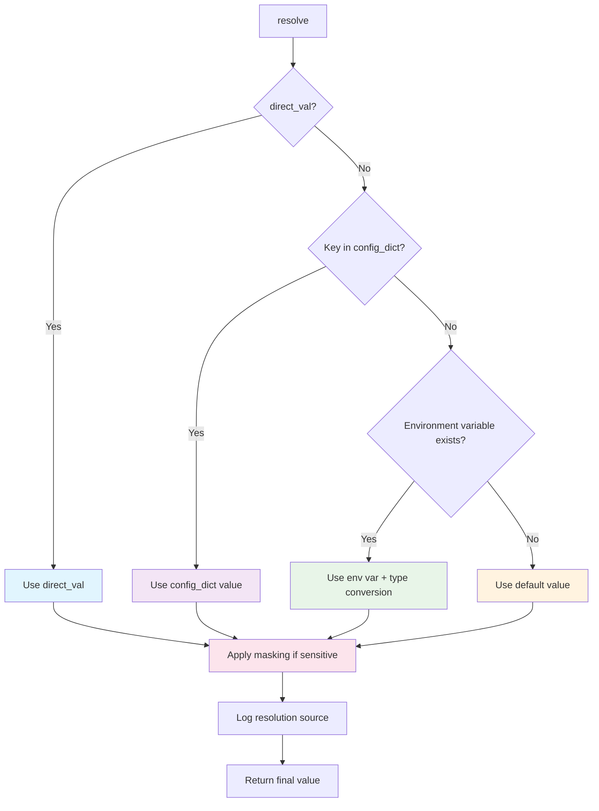
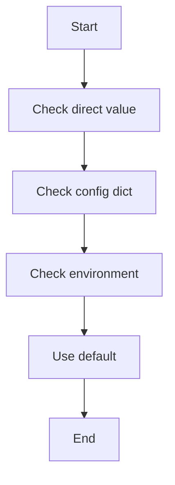

# Mermaid Test

Testing if the mermaid diagram renders correctly:

```mermaid
graph TD
    A[resolve] --> B{direct_val?}
    B -->|Yes| C[Use direct_val]
    B -->|No| D{Key in config_dict?}
    D -->|Yes| E[Use config_dict value]
    D -->|No| F{Environment variable exists?}
    F -->|Yes| G[Use env var + type conversion]
    F -->|No| H[Use default value]
    
    C --> I[Apply masking if sensitive]
    E --> I
    G --> I
    H --> I
    
    I --> J[Log resolution source]
    J --> K[Return final value]
    
    style C fill:#e1f5fe
    style E fill:#f3e5f5
    style G fill:#e8f5e8
    style H fill:#fff3e0
    style I fill:#fce4ec
```

Alternative simpler version:

```mermaid
flowchart TD
    A[Start] --> B[Check direct value]
    B --> C[Check config dict]
    C --> D[Check environment]
    D --> E[Use default]
    E --> F[End]
```